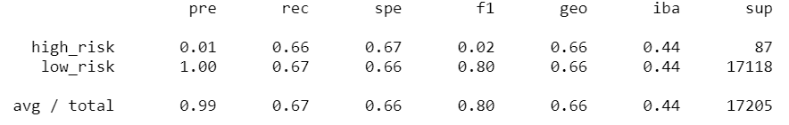
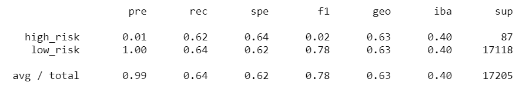
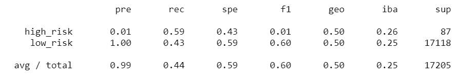
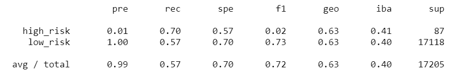
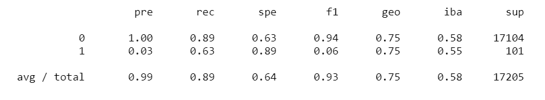
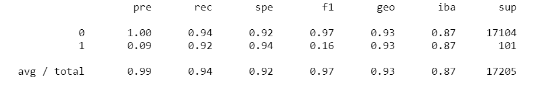
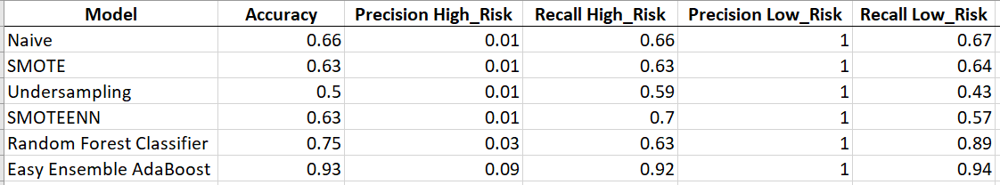

# Credit_Risk_Analysis

## Project Overview
Using the credit card credit dataset from LendingClub, a peer-to-peer lending services company, data was oversampled using the RandomOverSampler and SMOTE algorithms, and undersampled using the ClusterCentroids algorithm. 

Then, a combinatorial approach of over- and undersampling using the SMOTEENN algorithm was made. 

Next, two new machine learning models that reduce bias, BalancedRandomForestClassifier and EasyEnsembleClassifier, to predict credit risk were compared. 

The performance of these models were evaluated and a recommendation made on whether they should be used to predict credit risk.

## Resources
Data Source: [LoanStats_2019Q1.csv](https://github.com/k-wrenn/Credit_Risk_Analysis/blob/main/Resources/LoanStats_2019Q1.csv)

Software: Python 3.7.9, Jupyter Notebook

## Results
**Naive Random Oversampling**

- Balanced accuracy score: 0.66
- Imbalanced Classification Report:

**SMOTE Oversampling**

- Balanced accuracy score: 0.63
- Imbalanced Classification Report:

**Undersampling**

- Balanced accuracy score: 0.5
- Imbalanced Classification Report:

**SMOTEENN**

- Balanced accuracy score: 0.63
- Imbalanced Classification Report:

**Balanced Random Forest Classifier**

- Balanced accuracy score: 0.75
- Imbalanced Classification Report:

**Easy Ensemble AdaBoost Classifier**

- Balanced accuracy score: 0.93
- Imbalanced Classification Report:

## Summary

Among all the models, the low_risk precision is 1, which means there were no incorrect predictions on low-risk credit records. For the high_risk group, the precision is generally low, which means there is a quite high percentage of high-risk records that were incorrectly identified. For comparison of all models, refer to image below:

Easy Ensemble AdaBoost Classifier is the recommended model for this credit risk analysis, correctly predicting 93% (accuracy of 0.93). The undersampling model is the least recommended as it has the lowest accuracy (0.5), or correctly made predictions only 50% of the time.
